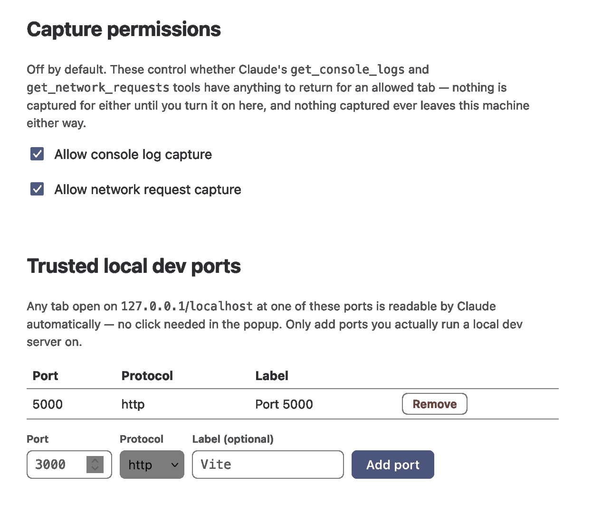

# Details

## How allow-listing works

- **Manual grants** are origin-scoped (`https://staging.example.com`, not a
  single tab) and expire the moment Firefox restarts. This is enforced by
  `browser.storage.session` — a Firefox API that's cleared by the browser
  itself on close, not by a timer the daemon has to get right.
- **Live-Server auto-approval** only ever matches an actual
  `127.0.0.1`/`localhost` origin on a port in the trusted list — a remote
  page can't claim to be "port 5500" to get in.
- A manual grant on the same origin as a trusted port **wins** over
  auto-approval, if you ever want to be more deliberate about it.
- The trusted-port list itself is edited from the extension's **Settings**
  page (add/remove ports, no daemon restart) — see
  [SETUP.md § Allow a tab](SETUP.md#4-allow-a-tab).

## Capture permissions

Allowing a tab only ever grants `get_page_content`/`screenshot_tab` access.
`get_console_logs` and `get_network_requests` are gated behind a second,
separate opt-in — off by default — because console output and request
headers can carry more incidental sensitive data than a page's rendered
content does:

- Turn them on from the extension's **Settings → Capture permissions**,
  per-toggle for console logs and network requests.
- Turning a toggle on takes effect immediately for already-allowed tabs, no
  reload needed. Turning it off stops new data from being sent to the
  daemon immediately, the daemon discards what it had already captured for
  that toggle, and the console hook restores the page's original `console`.
- Console capture starts at `document_start`, so it includes output from
  page load. Alongside `console.*` calls, it records uncaught exceptions,
  unhandled promise rejections and failed resource loads, each as a
  `level: "error"` entry with a `kind` saying which it was.
- Because Firefox match patterns can't specify a port, a trusted
  `localhost` port loads the hook on every `localhost` page. On a page that
  isn't allowed, the hook holds entries locally until the extension says
  no, then removes itself; nothing from that page is sent.
- Network capture includes failed requests (with `error`), redirect hops
  (with `redirectUrl`) and cached responses (`fromCache`).
- These settings are stored locally (`browser.storage.local`) and persist
  across restarts, unlike the origin allow-list itself — see
  [How allow-listing works](#how-allow-listing-works).



## The five tools

All read-only: `list_allowed_tabs`, `get_page_content`, `screenshot_tab`,
`get_console_logs`, `get_network_requests`. The last two return a
`CAPTURE_DISABLED` error for an allowed tab until you enable their matching
toggle, so an empty list always means nothing was captured, never that
capture was off — see [Capture permissions](#capture-permissions).
`screenshot_tab` returns the image as a real MCP `type: "image"` content
block (plus a small text block with `width`/`height`/`capturedAt`) — that's
what makes it something Claude actually *sees*, not just bytes it's
holding; a JSON blob with a base64 string buried inside it wouldn't render
as a picture to the model at all. See `tab-bridge-blueprint.md` Section 3
for exact input/output shapes and the standard error format
(`TAB_NOT_ALLOWED`, `TAB_NOT_FOUND`, `EXTENSION_DISCONNECTED`,
`CAPTURE_FAILED`, `CAPTURE_DISABLED`, `UNAUTHORIZED`).

## Development

```bash
just install
just typecheck   # tsc --noEmit across the daemon and shim
just test        # vitest — unit + integration tests, no real browser needed
just lint        # web-ext lint against extension/
# or just `just check` to run all three
just uninstall   # removes the global `tab-bridge` link and cleans build output
```

The MCP integration tests spin up a real daemon and a real `ws` WebSocket
client standing in for the Firefox extension, then drive the actual MCP
tools over `http` with the official MCP TypeScript SDK client — see
`packages/daemon/test/mcpServer.integration.test.ts` for the primary-journey
test (list → get_page_content → screenshot_tab against a real allowed tab)
and the `TAB_NOT_ALLOWED`/redaction tests. What these tests can't cover —
because there's no real Firefox in CI — is the extension side: DOM capture,
`tabs.captureTab`, and the MAIN-world console hook. Those need a manual
smoke test in real Firefox after any change to `extension/`.

## Roadmap

Not built yet, on purpose — see the blueprint's MVP Build Order for the
reasoning:

- **Opt-in recording mode** (persisting a tab's captured logs to disk across
  a daemon restart, or for exporting a bug report) — deliberately built
  after the in-memory-only default is solid, not before.
- **AMO signing/publishing, npm publish, CI running for real** — this repo
  is ready for all three, but they need your own Mozilla/npm/GitHub
  accounts to actually execute.
- Cowork/cloud reachability, native-messaging transport, a DevTools-panel
  UI — explicitly out of scope for this first build.
