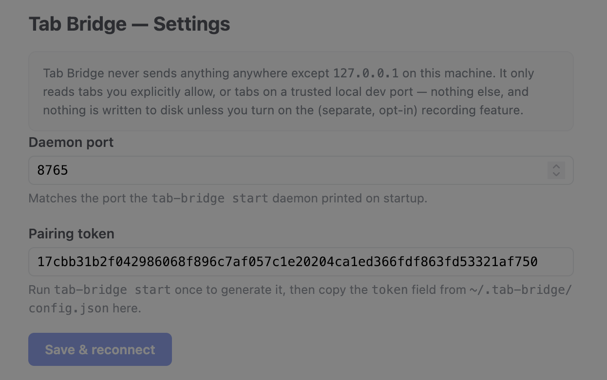
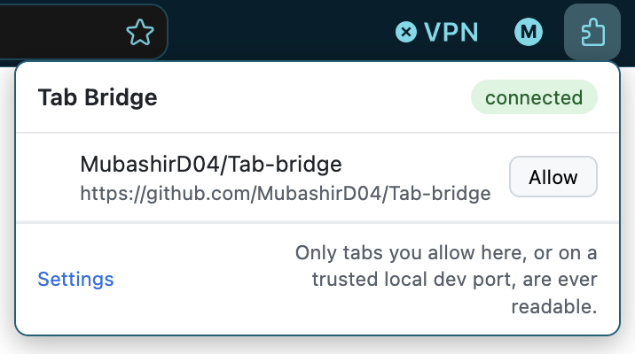

# Setup details

## 1. Build the daemon

```bash
just install   # npm install + build + `npm link` to put `tab-bridge` on PATH
```

(No `just`? The underlying steps are `npm install`, `npm run build`, then
`cd packages/daemon && npm link && cd ../..`. `just uninstall` reverses
this — it removes the global link and cleans build output.)

Then either leave it running continuously:

```bash
tab-bridge start
# ...later, when you're done:
tab-bridge stop
```

...or manage it on demand — see [Running the daemon on demand](#running-the-daemon-on-demand)
below for a skill that starts it only when needed and stops it afterward,
the same shape as a skill that spins up a headless browser for one task.
Either way, `tab-bridge start` prints the port it's listening on and its
pairing token (also written to `~/.tab-bridge/config.json`) — you'll need
that token in a moment. `tab-bridge status` prints the same token if the
daemon is already running and you missed it the first time.

## 2. Load the extension in Firefox

This repo isn't signed/published yet (see [DETAILS.md § Roadmap](DETAILS.md#roadmap)),
so load it as a temporary add-on for now:

1. Go to `about:debugging#/runtime/this-firefox`.
2. Click **Load Temporary Add-on…** and select `extension/manifest.json`.
3. Click the Tab Bridge toolbar icon → **Settings**, paste in the pairing
   token `tab-bridge start` printed to the terminal (also in
   `~/.tab-bridge/config.json`), confirm the daemon port matches what it
   printed, and save.

(A temporary add-on unloads when Firefox restarts — you'll reload it each
session until it's signed. `npm run lint:extension` runs the same
`web-ext lint` check used before packaging a real build.)



If the popup's status badge says **wrong token** instead of **not
connected**, the daemon is running and reachable but rejected the pairing
token — re-check it against what `tab-bridge status` prints. **Not
connected** means the daemon itself isn't reachable on the configured port
(most likely `tab-bridge start` isn't running).

## 3. Point your MCP client at the daemon

**Claude Code** — `tab-bridge start` (and `tab-bridge status`) writes/refreshes
the `tab-bridge` entry in `.mcp.json` in whatever directory you ran it from,
automatically — no copy-pasting the port/token by hand. Run it from your
project root (wherever you'll launch Claude Code) and you're done; it
preserves any other `mcpServers` entries already in the file, and adds
`.mcp.json` to `.gitignore` if one exists there and doesn't already exclude
it (the file holds a live bearer token). If you'd rather wire it up by hand,
or the daemon is running from somewhere other than your project directory,
this is what it writes:

```json
{
  "mcpServers": {
    "tab-bridge": {
      "type": "http",
      "url": "http://127.0.0.1:8765/mcp",
      "headers": { "Authorization": "Bearer <token printed by tab-bridge start/status>" }
    }
  }
}
```

**Claude Desktop** — add to `claude_desktop_config.json`:

```json
{
  "mcpServers": {
    "tab-bridge": {
      "command": "node",
      "args": ["/absolute/path/to/tab-bridge/packages/mcp-stdio/dist/index.js"],
      "env": {
        "TAB_BRIDGE_TOKEN": "<token printed by tab-bridge start/status>",
        "TAB_BRIDGE_URL": "http://127.0.0.1:8765/mcp"
      }
    }
  }
}
```

## 4. Allow a tab

Open the site you're working on. If it's already on a trusted local dev
port (`http://127.0.0.1:5500`/`5501` by default — VS Code Live Server's
ports), it's allowed automatically; otherwise click the Tab Bridge icon and
hit **Allow** next to the tab. Then just ask Claude about it.



Running Vite, webpack-dev-server, or Live Server on a different port? Add it
from **Settings → Trusted local dev ports** — no daemon restart or manual
JSON editing needed.

## Running the daemon on demand

`tab-bridge start` and `tab-bridge status` both print the pairing token to
the terminal, so a skill or user checking on the daemon on demand can see it
immediately instead of opening `~/.tab-bridge/config.json`.

`tab-bridge stop` and PID tracking (`~/.tab-bridge/daemon.pid`) exist so the
daemon doesn't have to be a thing you remember to leave running:
`skill/tab-bridge/SKILL.md` is a Claude Code skill that checks
`tab-bridge status`, starts the daemon only if it isn't already up, does the
actual tool calls, and stops it again afterward — but only if this
invocation was the one that started it, so it never kills a daemon you (or
an earlier turn) deliberately left running. Copy `skill/tab-bridge/` into
`~/.claude/skills/tab-bridge/` (available in every project) or a project's
own `.claude/skills/tab-bridge/`.

Two honest limitations, not glossed over in the skill's own instructions
either:

- **`get_console_logs`/`get_network_requests` only ever show activity
  captured while the daemon was running.** Starting it on demand means you
  get logs from that point forward, not retroactively — if you're chasing
  an error that already happened, the daemon needs to have been running
  *before* it happened. For continuous log capture, leave it running (or
  set it up as an OS autostart entry) instead of using the on-demand skill.
- **Claude Code doesn't reliably do a lazy/retry connection for HTTP MCP
  servers that weren't up at session start** (this is a known, open
  limitation, not a Tab Bridge bug). If `tab-bridge`'s tools don't show up
  right after the skill starts the daemon, run `/mcp` to reconnect. Claude
  Desktop's stdio transport is worse on this front — it won't reconnect a
  failed stdio server without the app itself relaunching it — so the
  on-demand model is really a Claude Code pattern; for Desktop, just leave
  the daemon running.
