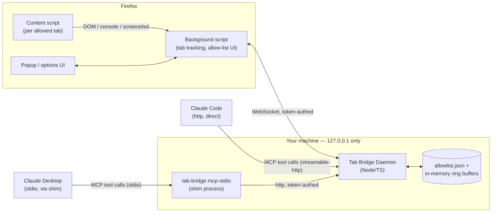

# Tab Bridge — Technical Blueprint

**One-line summary:** A local daemon + Firefox extension that lets Claude (Code, primarily, or Desktop for a quick look) read the HTML, console logs, network requests, and screenshots of specific browser tabs you've explicitly allowed — plus auto-approves any tab pointed at your local VS Code Live Server — with everything staying on your own machine, and designed from the start to be safe for other people to run too.

**Assumptions made:**
- Runtime scope is still single-user, single-machine per install — there's no multi-tenancy or account system. "Open source" here means *other people each run their own instance*, not a shared/hosted service, so the architecture doesn't change, but the defaults, docs, and trust story now have to hold up for a stranger's install, not just yours.
- "VS Code Live Server" means the common `ritwickdey.LiveServer` extension (default port `5500`, `5501` for HTTPS), but the trusted-port list is user-configurable so it also covers Vite, webpack-dev-server, or a custom Live Server port.
- Claude Code is the primary client (it can talk to the daemon's `http` MCP endpoint directly); Claude Desktop is a secondary "quick look" client. Desktop's MCP support is **stdio-only for local servers** (confirmed via research — Desktop's local transport doesn't do HTTP; only Claude Code supports stdio/SSE/HTTP/WebSocket), so Desktop needs a small stdio shim in front of the daemon rather than connecting directly — see the updated Components table below. Cowork/cloud access is still explicitly out of scope.
- Capture scope is all four of: rendered screenshot, HTML/DOM, console logs, and network requests — all four are in the MVP.
- The daemon is a long-lived local process you start independently of any MCP client, so the extension always has somewhere to connect regardless of whether Claude Code or Desktop happens to be open.
- **Decided (no longer open):** a manual "allow this tab" grant lasts only until the browser restarts — no persistent-by-default grants. `Authorization` and `Cookie`/`Set-Cookie` headers are redacted by default in captured network requests, with no default opt-out surfaced in the UI (see Security).
- **Decided:** console/network logs are **not** persisted to disk by default — they stay in the daemon's in-memory ring buffers and are lost on daemon restart, same as before. See the new "Log persistence" note in Section 2 for the reasoning and the opt-in alternative.

**Open questions:**
- License choice for the open-source release — MIT is the sensible default for a permissive dev tool and is what the Cost/Deployment sections below assume, but worth confirming.
- Listed vs. self-distributed (unlisted) publishing on `addons.mozilla.org` once you're ready to share it — both are free and both get signed; listed is more discoverable for other users but goes through Mozilla's standard review queue. Not a Phase 1 decision.
- Whether to run the daemon as an OS-level autostart service (launchd/systemd/Task Scheduler) — reasonable to decide once you're set up, not before, and something each user could reasonably choose differently.

---

## 1. System Architecture Blueprint

### Components

| Component | Responsibility | Why it exists for this idea |
|---|---|---|
| **Firefox extension** (background script, content scripts, popup/options UI) | Tracks open tabs, lets you toggle "allow Claude to view this tab," injects a content script into allowed tabs to read DOM/console, captures screenshots via `tabs.captureTab` | Firefox has no equivalent to the Claude-in-Chrome extension, and this is the only way to get in-page access (DOM, console, screenshots) from inside Firefox at all |
| **Tab Bridge Daemon** (Node/TypeScript, runs on your machine) | Long-running local process; is *both* the WebSocket server the extension talks to *and* the MCP server exposed over `http`; owns the allow-list, the Live-Server auto-detect logic, and bounded in-memory buffers of captured data | Decouples "is an MCP client open" from "is the extension connected" — the extension always has a stable local endpoint, and any client just points at it |
| **`tab-bridge mcp-stdio` shim** (thin Node process) | A tiny stdio-based MCP server that Claude Desktop launches as a subprocess (Desktop's config only supports `command`-based stdio servers); on startup it connects to the already-running daemon over its `http` endpoint using the pairing token and simply forwards each tool call/response between stdio and the daemon | Exists purely because Desktop can't speak `http` to a local server directly — it's a translation layer, not a second implementation of the tools. Same allow-list, same daemon, same source of truth |
| **Claude Code** (primary MCP client) | Calls MCP tools directly against the daemon's `http` endpoint | Runs locally, supports `http` transport, so it hits `127.0.0.1` with no relay and no shim needed |
| **Claude Desktop** (secondary, "quick look" MCP client) | Launches `tab-bridge mcp-stdio` as a subprocess per its config; talks stdio MCP to that shim | For a quick check outside your terminal — same tools, same permissions, just a different transport hop |

Everything binds to `127.0.0.1` only. Nothing in this design talks to the public internet or to Cowork/cloud sessions — that's a deliberate boundary, not an oversight (see Security, below).

### Primary user journey: request/response flow

Scenario: you're editing a page served by VS Code Live Server, and you've also manually allow-listed a staging tab, then ask Claude Code to figure out why a button is misaligned.

1. You open `http://127.0.0.1:5500/index.html` in Firefox (served by Live Server) and separately click "Allow Claude to view this tab" in the Tab Bridge popup for a second tab, `https://staging.myapp.com`.
2. The extension's background script notices the `5500` tab's URL matches a trusted dev port and marks it `source: "live-server-auto"` — no manual click needed for that one. It sends a `tab_connected` event over the WebSocket to the daemon for both tabs.
3. The daemon updates its in-memory `TabSession` map. The Live-Server tab isn't written to `allowlist.json` (it's derived from the trusted-port list, not a manual grant); the staging tab is.
4. In Claude Code, you ask: "why is the submit button misaligned on my Live Server tab?"
5. Claude Code calls `list_allowed_tabs()` against `http://127.0.0.1:<port>/mcp`, with the pairing token in the request header.
6. The daemon returns both `TabSession`s.
7. Claude Code calls `get_page_content({ tabId: <live-server-tab-id>, mode: "html" })`.
8. The daemon checks that tab ID against its session map (if it weren't present, this would return a `TAB_NOT_ALLOWED` error instead) and forwards a `get_content` request over the WebSocket to the extension.
9. The background script relays it to the content script running in that tab, which serializes `document.documentElement.outerHTML` (size-capped) and returns it up the chain.
10. The daemon wraps the HTML in the tool response and returns it to Claude Code over the MCP HTTP response.
11. Claude spots a suspicious class name and calls `screenshot_tab({ tabId })` to confirm visually before proposing anything.
12. The daemon asks the background script to run `browser.tabs.captureTab(tabId)`, gets back a PNG, and returns it as base64.
13. Claude proposes a CSS fix in your editor. Nothing is written back into the browser automatically — Tab Bridge is read-only in this design; it observes tabs, it doesn't control them.

If you'd instead asked from Claude Desktop for a quick look, steps 5-10 are identical except the call leaves Desktop as stdio, hits the `tab-bridge mcp-stdio` shim process, and that shim forwards it to the same daemon `http` endpoint using the same pairing token — same allow-list, same answer, one extra hop.

### Diagram



---

## 2. Data Model & Schema Spec

### Storage engine

No database — this is a single-user local tool with bounded, ephemeral state. The daemon keeps everything in memory and persists only the allow-list and trusted-port config to a small JSON file (`~/.tab-bridge/config.json`). A relational or document store would be pure overhead here.

### Entities (entity-relationship overview)

- **AllowlistEntry** — a manually-granted permission. Fields: `id`, `originPattern` (e.g. `https://staging.myapp.com/*`), `label`, `addedAt`, `expiresAt` (always set to the next browser restart — this is now the fixed behavior, not a configurable default; re-granting after every restart is the deliberate friction that keeps a forgotten grant on a sensitive tab from lingering), `source: "manual"`. Persisted to disk so the daemon can tell "still valid this session" apart from "granted in a previous session," but a restart invalidates it regardless of what's on disk.
- **TrustedDevPort** — a localhost port treated as auto-approved. Fields: `port`, `label` (e.g. "VS Code Live Server"), `protocol: "http"|"https"`. Persisted to disk, seeded with `5500`/`5501` by default, user-editable.
- **TabSession** — a currently-open tab the daemon knows about *right now*. Fields: `tabId`, `windowId`, `url`, `title`, `allowlistEntryId` (nullable — set when matched to an `AllowlistEntry`), `matchedTrustedPort` (nullable — set when matched to a `TrustedDevPort`), `connectedAt`, `lastSeenAt`. In-memory only; rebuilt from the extension's state on every WebSocket (re)connect, since tabs open/close constantly and persisting them would just go stale.
- **ConsoleLogEntry** — one captured console call. Fields: `tabId`, `timestamp`, `level` (`log`/`warn`/`error`/`info`/`debug`), `args` (safely stringified, depth- and size-capped), `stackTrace` (optional). Kept in a per-tab ring buffer (default: last 500 entries or 5 minutes, whichever is smaller), evicted on tab close.
- **NetworkRequestEntry** — one observed request. Fields: `tabId`, `requestId`, `timestamp`, `method`, `url`, `type` (`xhr`/`fetch`/`document`/etc.), `statusCode` (nullable until response arrives), `requestHeaders`, `responseHeaders`, `timingMs`. Same per-tab ring buffer as console logs. `Authorization`/`Cookie`/`Set-Cookie` header values are redacted (`"[redacted]"`) by default, fixed behavior — see Security.
- **PairingToken** — the shared secret proving a WebSocket or MCP client is really your extension/daemon-adjacent process, not another local process. Fields: `token`, `createdAt`, `rotatedAt`. One active token at a time; rotating invalidates old connections.
- **RecordingSession** *(opt-in only, off by default — see "Log persistence" below)* — Fields: `tabId`, `startedAt`, `filePath`, `expiresAt` (auto-delete after 7 days unless exported). Only created when you explicitly start a recording for a tab; nothing here exists in the default flow.

Relationships: a `TabSession` optionally references one `AllowlistEntry` or one `TrustedDevPort` (never both — auto-approval and manual grant are mutually exclusive per session, manual takes precedence if both would match); `ConsoleLogEntry` and `NetworkRequestEntry` both belong to exactly one `TabSession` by `tabId` and disappear when that tab closes, unless a `RecordingSession` is active for it.

### Access-pattern notes

No indexes in the traditional sense (nothing is a database), but the equivalent design choice is the ring-buffer cap per `tabId` — without it, a chatty tab (constant `console.log` spam, a polling XHR) would grow unbounded in memory for as long as the daemon runs. The cap is the thing standing in for an index/retention policy here.

### Log persistence — decision and reasoning

You asked whether console/network logs should be persisted. The recommendation is **no, not by default**, and here's the reasoning rather than just the answer:

The in-memory ring buffers already cover the common case — "what just happened in the last few minutes on this tab" survives fine without touching disk, because a daemon restart is a relatively rare event in normal use. What persisting *would* buy you is continuity across a daemon crash/restart, or the ability to export a debugging session to attach to a bug report. But these buffers are also the most sensitive data in the whole system: `Authorization`/`Cookie` header redaction only covers header *names* — it does nothing for a token sitting in a URL query string (`?api_key=...`) or in a request/response body, both of which network entries can legitimately contain. Writing that to disk by default, indefinitely, is a meaningfully bigger promise than "lives in RAM until the process exits," especially once this is something other people install and point at their own staging/auth-bearing tabs. For an open-source tool whose entire pitch rests on "this only sees what you explicitly let it see, and doesn't keep it," silently writing captured page data to disk would undercut that pitch.

So: default stays ephemeral, matching the rest of the privacy posture (session-only grants, redaction, no self-expanding access). For the real need — surviving a restart, or exporting a bug report — add an **explicit opt-in "recording" mode**, separate from "allow": a `tab-bridge record --tab <id>` command (or a popup toggle, clearly distinguished from "allow") streams that tab's ring buffer to `~/.tab-bridge/recordings/<tabId>-<timestamp>.jsonl`, with the same header redaction applied and a best-effort (not guaranteed — flag this honestly in the UI) regex pass for obviously token-shaped query-string values. Recordings auto-delete after 7 days unless you explicitly export them, so opting in once doesn't quietly turn into an ever-growing pile of old debug data on disk. This is the same pattern as the read-only tool surface: the safer behavior is the default, and the more powerful/riskier behavior requires your deliberate action every time.

---

## 3. API Interface Definition

### Style

This isn't a REST/GraphQL API for external clients — the clients are MCP clients. The daemon exposes an MCP server over **streamable-http** (`POST /mcp`), bound to `127.0.0.1`, requiring the pairing token as a bearer header. Claude Code, which supports `http` transport directly, registers it in `.mcp.json`:

```json
{
  "mcpServers": {
    "tab-bridge": {
      "type": "http",
      "url": "http://127.0.0.1:8765/mcp",
      "headers": { "Authorization": "Bearer ${TAB_BRIDGE_TOKEN}" }
    }
  }
}
```

Claude Desktop's local MCP support is stdio-only (confirmed via research — its `claude_desktop_config.json` launches a subprocess by `command`; it doesn't speak `http` to a local server, and its only route to remote `http` servers is Custom Connectors through Anthropic's cloud, which is the wrong trust boundary for this tool entirely). So Desktop instead launches the shim, which does the `http` call on its behalf:

```json
{
  "mcpServers": {
    "tab-bridge": {
      "command": "npx",
      "args": ["tab-bridge", "mcp-stdio"],
      "env": { "TAB_BRIDGE_TOKEN": "..." }
    }
  }
}
```

Both configs expose the identical tool set below — the shim is a transport adapter, not a second surface to keep in sync.

### Tools

All tools are **read-only** by design — there is deliberately no `allow_tab` or `revoke_tab` tool. Claude can never grant itself access to a new tab; only you can, through the extension's popup. That asymmetry is the core safety property of this whole design.

| Tool | Input | Output |
|---|---|---|
| `list_allowed_tabs` | *(none)* | `{ tabs: [{ tabId, title, url, origin, source: "manual"\|"live-server-auto", connectedAt }] }` |
| `get_page_content` | `{ tabId, mode: "html"\|"text" }` | `{ tabId, url, capturedAt, content, truncated: boolean }` |
| `screenshot_tab` | `{ tabId, format?: "png"\|"jpeg" }` | `{ tabId, capturedAt, imageBase64, width, height }` |
| `get_console_logs` | `{ tabId, since?: ISO8601, levels?: string[], limit?: number }` | `{ tabId, entries: ConsoleLogEntry[] }` |
| `get_network_requests` | `{ tabId, since?: ISO8601, urlFilter?: string, limit?: number }` | `{ tabId, entries: NetworkRequestEntry[] }` |

### Standard error structure

Every failed tool call returns the same shape:

```json
{ "error": { "code": "TAB_NOT_ALLOWED", "message": "Tab 42 is not on the allow-list.", "tabId": 42 } }
```

Codes used: `TAB_NOT_ALLOWED`, `TAB_NOT_FOUND` (tab closed since it was listed), `EXTENSION_DISCONNECTED` (daemon has no live WebSocket to the extension right now), `CAPTURE_FAILED` (e.g. `captureTab` failed on a tab mid-navigation), `UNAUTHORIZED` (bad/missing pairing token).

---

## 4. Technical Constraints & State Matrix

### Non-functional requirements

- **Users:** exactly one (you), one machine. No concurrency design needed beyond "don't block the WebSocket loop while serving an MCP call."
- **Latency:** `list_allowed_tabs` / `get_console_logs` / `get_network_requests` should return in well under 200ms (pure in-memory lookups). `get_page_content` involves a background-script → content-script round trip inside Firefox — budget ~300-500ms. `screenshot_tab` is the slow one (capture + PNG encode) — budget 1-2s, and callers should expect that.
- **Availability:** no uptime target in the traditional sense — it's fine for the daemon to only be running while you're actively developing. The one requirement is that it fails *loudly and clearly* (a `EXTENSION_DISCONNECTED` error) rather than hanging when the extension isn't connected.
- **Storage growth:** bounded by design — ring buffers cap console/network history per tab, and `TabSession`s are never persisted, only rebuilt live. `allowlist.json` and `config.json` stay tiny (kilobytes) indefinitely.

### State management strategy

Everything lives in the daemon's process memory, seeded at startup from two small JSON files on disk (allow-list, trusted ports). The WebSocket connection to the extension is treated as unreliable by design — Firefox can suspend/reload a background script's event page at any time — so on every reconnect, the daemon asks the extension for a full snapshot of currently-open, currently-allowed tabs and rebuilds its `TabSession` map from scratch rather than trying to patch a possibly-stale one.

### Trade-offs

| Decision | Buys you | Costs you later |
|---|---|---|
| WebSocket (not native messaging) between extension and daemon | Much simpler to build and debug; no per-OS native-messaging manifest registration | A locally-running malicious process could in principle also try to connect to the port — mitigated by the pairing token, but native messaging (browser-spawned, no open port) is strictly more locked-down if you outgrow this |
| Daemon owns MCP *and* extension WebSocket in one process | One thing to run, one thing to reason about, no relay | If you ever want Cowork/cloud access, this process boundary has to be rethought — it's not designed to be reachable off-machine |
| No persistence of `TabSession`/logs across daemon restarts | Simple, no migration story, no stale data | Restarting the daemon mid-debugging-session loses console/network history for open tabs until they're re-detected |
| Read-only tool surface (no `allow_tab` tool) | Claude can never expand its own access — a strong, simple safety property | Slightly more friction: you have to go click "allow" in the popup yourself every time, there's no way to streamline that from the Claude Code side |

---

## 5. Security Considerations

The threat surface here is specific: this extension, once granted access to a tab, can read that tab's rendered HTML, its console output, its network traffic (potentially including auth tokens in headers), and take screenshots of it. That's a lot of trust to hand a piece of software, so the mitigations matter more than usual for a personal tool:

- **Localhost-only binding.** The daemon's WebSocket and MCP HTTP server both bind to `127.0.0.1` explicitly, never `0.0.0.0`. This rules out anything on your LAN reaching it.
- **Pairing token on both channels.** The extension's WebSocket connection and Claude Code's MCP calls both must present the same locally-generated token. Without this, any other local process (another browser extension, another app running as your user) could otherwise connect to an open localhost port and either impersonate the extension or read tab data as if it were Claude Code.
- **Header redaction by default, no UI opt-out.** `get_network_requests` redacts `Authorization`, `Cookie`, and `Set-Cookie` values by default, and this is now fixed behavior rather than configurable — see Assumptions. This is the single highest-value mitigation in the whole design; it's deliberately not something a first-run user (including someone other than you, once this is open source) can accidentally switch off while exploring settings.
- **Allow-list can't be self-expanded.** As noted in Section 3, there's no tool that lets Claude request or grant tab access — only your click in the popup does that. This means even a fully compromised or misbehaving MCP client can't widen its own reach.
- **`<all_urls>` host permission is unavoidable, but doesn't widen actual read access.** `tabs.captureTab` (Section 3, step 12 — screenshotting a tab that isn't necessarily the active one) requires it in Firefox; there's no narrower permission that supports capturing a non-active tab on demand rather than in response to a fresh user gesture. Firefox surfaces this to the user as "access your data for all websites" at install, which is real and worth being upfront about (see README), but it only grants the *capability*; every actual read (HTML, console, network, screenshot) still goes through the allow-list check on every tool call, same as before this permission existed.
- **Session-scoped grants, fixed.** A manual "allow" always expires at the next browser restart — see Assumptions/Section 2 — so an old grant on a since-forgotten sensitive tab doesn't linger.
- **Logs stay in memory by default.** Console/network capture is never written to disk unless you explicitly start a recording (Section 2) — this bounds the blast radius of the header-redaction gap (query-string tokens, response bodies) to "was in RAM while the daemon ran" rather than "sits on disk indefinitely."
- **Live-Server auto-approval is host-scoped, not spoofable.** The trusted-port match only fires for `127.0.0.1`/`localhost` origins — a remote page can't claim to be "port 5500" to get auto-approved, because the match is on the actual origin the browser resolved, not on anything the page can control.
- **No cloud relay.** Nothing here talks to the internet, including the Desktop path — the `mcp-stdio` shim only ever calls back to `127.0.0.1`. If you later want Claude to see these tabs from a Cowork/cloud session, that's a deliberately separate, separately-secured piece of future work — not something this design quietly enables by accident.
- **Safe serialization of captured data.** The console-log and DOM-capture paths use depth- and size-capped serialization, not `eval`/`Function` or unbounded recursive stringification, to avoid both a hang on pathological pages and any path for page-controlled data to execute in the extension's privileged context.
- **Now that other people will run this too:** these defaults (redaction on, grants session-scoped, logs ephemeral, read-only tool surface) *are* the product's trust story for a stranger deciding whether to install something with broad tab-read permissions — they belong front and center in the README, not buried in a settings page.

---

## 6. Legal & Trust Considerations

Each install is still single-user and local, so the heavy consumer-facing obligations (ToS, PCI scope, cross-user moderation) genuinely don't apply — but distributing this as open source to other developers adds a few things worth naming plainly, since "no other users" no longer means "no one else is affected by my choices here":

- **License.** Ship a `LICENSE` file — MIT (proposed default, swappable) is the norm for a permissive dev tool like this and keeps the barrier to trying it low.
- **No-telemetry commitment, stated explicitly.** Given the breadth of access this extension requests (tab content, console, network, screenshots), "does this phone home" is the first question a careful developer will ask before installing it. The design as specified sends nothing anywhere except `127.0.0.1` — say so plainly and prominently in the README, not just implicitly through the architecture.
- **No warranty, standard OSS disclaimer.** Since other people are trusting this with access to their own dev tabs (possibly including staging/auth-bearing ones), a standard "provided as-is, no warranty" disclaimer belongs in the README alongside the license, same as any OSS project handling anything privacy-sensitive.
- **Content still flows through whatever LLM the user points it at.** Same note as before, now generalized: whatever tab a user allow-lists, its captured content can end up in that user's Claude context if they ask about it — the same as pasting it into chat themselves. Worth one line in the README so a new user's first allow-list decision is an informed one, not an accidental one.

No regulated data category (payments, health data) is inherent to this design — that stays true regardless of who's running it.

---

## 7. Cost Ballpark

**$0/month, for you and for anyone else who runs it.** Everything — the daemon and the extension — runs entirely on each user's own machine; there's no hosting, database, or third-party API anywhere in this design, and that stays true no matter how many people install it, since there's no shared backend. The only cost at all is Mozilla's extension-signing step, and it's free either way you distribute it: self-distributed/"unlisted" signing via `addons.mozilla.org` (simplest, good enough for personal use and for early open-source adopters comfortable installing a signed `.xpi` from GitHub) or listed/public signing (better discoverability, same price, goes through Mozilla's standard review queue — worth doing once the project is stable, per the Open Questions above).

---

## 8. Deployment & CI/CD Strategy

Sized for a small open-source project with one primary maintainer (you) — no staging/prod split needed, since "prod" is "running on each user's own machine," but a public repo does raise the bar slightly above pure personal-tool hygiene:

- **Environments:** one — the dev/test loop on your machine. A packaged release build (signed `.xpi` + a published npm package for the daemon/shim) is the artifact everyone else installs.
- **How a change ships:** a GitHub Actions workflow on tag push: lint + unit-test the daemon, `web-ext build && web-ext sign` the extension, publish the npm package (daemon + `mcp-stdio` shim, same package per Section 1) and attach the signed `.xpi` as a release asset. No auto-deploy to end users — each person updates on their own schedule, which is appropriate and expected for a tool like this.
- **Rollback:** trivial by construction — there's no shared server state to roll back, for you or for any other user. Reinstalling the previous daemon version or previous `.xpi` build fully reverts behavior on that machine.
- **Repo hygiene for other contributors/installers:** a README that leads with the trust story from Section 6 (no telemetry, localhost-only, read-only tools), a `LICENSE` file, and a short `CONTRIBUTING` note — lightweight, but present, since "explain it to a stranger" is now a real requirement, not a nice-to-have.

---

## 9. Testing Strategy

Prioritized by what actually breaks quietly and expensively here — which, for this project, is the allow-list logic and the redaction logic, not UI polish:

- **Allow-list & port-matching logic (daemon):** real unit test coverage. Origin-pattern matching, the "manual grant beats auto-approval" precedence rule, trusted-port matching (including the "must actually be `127.0.0.1`/`localhost`, not just claim to be" check), and token-expiry/rotation all get explicit tests — these are the paths where a bug means either "Claude can't see a tab it should" (annoying) or "Claude can see a tab it shouldn't" (the actual risk in this whole design).
- **Header redaction:** a dedicated test asserting `Authorization`/`Cookie`/`Set-Cookie` never appear unredacted in `get_network_requests` output unless the opt-out is explicitly set — this is the single test most worth never letting regress.
- **MCP tool layer:** integration tests against the `http` endpoint using a mock WebSocket client standing in for the extension, covering each tool's success path and its `TAB_NOT_ALLOWED`/`TAB_NOT_FOUND`/`EXTENSION_DISCONNECTED` error paths. The `mcp-stdio` shim gets its own thin integration test too — start it against a running test daemon and assert it forwards a call and an error path through unchanged, since a silent transport-layer bug there would only surface for Desktop users, not during Claude Code development.
- **End-to-end smoke test (the primary journey):** start the daemon, load the extension into a temporary Firefox profile via `web-ext run`, allow-list a local test page, then drive the actual MCP tools from a small test client script and assert real content comes back. This is the one test that catches "each piece works alone but the wiring is wrong."
- **Extension UI (popup/options):** lighter coverage — manual testing initially, with `web-ext`/Playwright-driven E2E as a later addition rather than day-one investment. This is where bugs are annoying, not dangerous, so it gets less rigor than the allow-list/redaction paths.

---

## 10. Observability & Monitoring

No paging, no dashboards — single user, single machine, nothing to alert *someone else* about. What's actually useful:

- **Structured local log file** (`~/.tab-bridge/daemon.log`, rotated): connection/auth events (extension connected/disconnected, pairing token used/rejected), every MCP tool call logged as `{tool, tabId, timestamp, ok/error}` — deliberately *not* logging the captured content itself (page HTML, screenshots) into this file, to avoid the log becoming its own sensitive-data sink.
- **A `get_tab_status` style check** (could be a CLI command, `tab-bridge status`, or folded into `list_allowed_tabs`'s response as a `daemonHealthy`/`extensionConnected` flag) — this is the practical answer to "is this working right now," which is the only observability question that actually matters at this scale.
- **Verifying the latency targets from Section 4:** not worth automated alerting for a personal tool — if `screenshot_tab` starts taking 10 seconds instead of 2, you'll notice immediately because you're the one waiting on it.

---

## 11. MVP Build Order

1. **Daemon core** — config/pairing-token generation, `allowlist.json`/`config.json` persistence, WebSocket server for the extension protocol, trusted-port matching logic, unit tests for allow-list and port matching (this phase's tests land now, not later).
2. **Extension skeleton** — manifest, background script that connects to the daemon over WebSocket with the pairing token, popup UI listing open tabs with an allow/revoke toggle, options page for pairing and editing the trusted-port list. Manual check: toggling "allow" on a tab shows up as a `TabSession` on the daemon side.
3. **Capture pipeline** — content-script injection into allowed tabs for `get_page_content` (HTML/text), `browser.tabs.captureTab` for screenshots, a `console.*` hook in the content script that reports up to the daemon, and a `webRequest` listener scoped to allowed tab IDs for network capture with header redaction applied at capture time (not as an afterthought).
4. **MCP tool layer, both transports** — implement all five tools over streamable-http, wire them to the daemon's in-memory state, enforce the token on the MCP endpoint, register in `.mcp.json`, and run the first real query from Claude Code against a genuinely open, allowed tab. Build the `tab-bridge mcp-stdio` shim in the same phase (it's a thin forwarder against tools that already exist by this point) and verify the identical query works from Claude Desktop. This is the phase where the primary journey from Section 1 becomes real end-to-end, including its smoke test, for both clients.
5. **Live-Server auto-approval** — verify a Live-Server tab (default port and a custom port) gets auto-approved with no manual click, and that an explicit revoke still overrides it.
6. **Hardening** — token rotation, ring-buffer eviction under load (a chatty console/network tab), the `EXTENSION_DISCONNECTED`/`TAB_NOT_FOUND` error-path tests, structured logging to file, and the opt-in recording mode from Section 2 (deliberately built after the ephemeral default is solid, not before).
7. **Open-source packaging** — `LICENSE`, README leading with the trust story (Section 6), `CONTRIBUTING`, `web-ext sign` for the extension, publish the npm package, first tagged release via the CI workflow from Section 8. This is the phase that turns "works on my machine" into "installable by a stranger."
8. **Explicitly out of scope for this MVP** (don't build these now): a `request_tab_access` tool that lets Claude prompt for new access, Cowork/cloud reachability, native-messaging transport in place of the WebSocket, and a DevTools-panel UI in place of the popup — all reasonable later extensions, none of them blocking the workflow you described.
